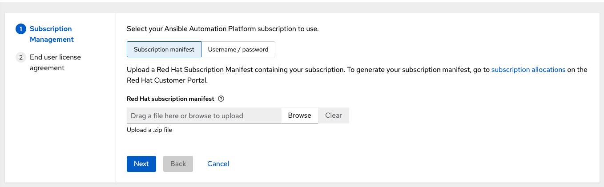
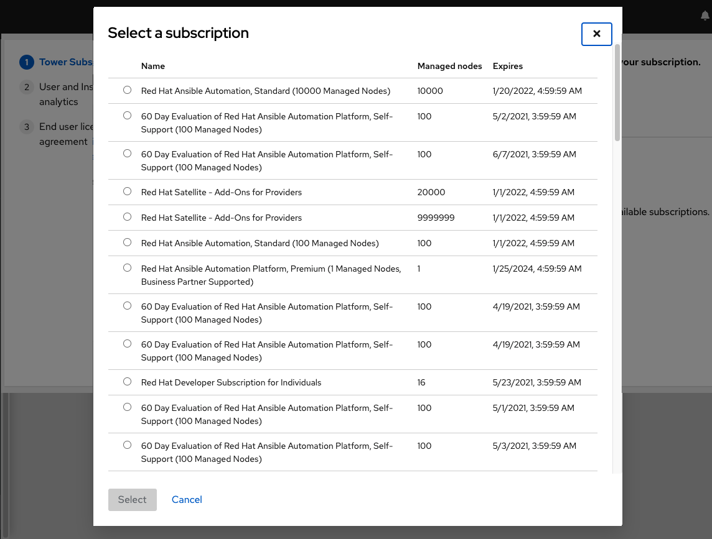
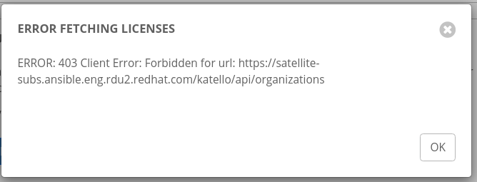

Available subscriptions or a subscription manifest authorize the use of the automation controller. To obtain your automation controller subscription, you can either: 

1. Provide your Red Hat or Satellite username and password on the license page.
2. Obtain a subscriptions manifest from your Subscription Allocations page on the customer portal. See :ref:`obtain_sub_manifest` in the |atu| for more detail. 

If you **have** a |rhaap| subscription, use your Red Hat customer credentials when you launch the controller to access your subscription information (see instructions below).

If you **do not** have a |rhaap| subscription, you can request a trial subscription `here <https://www.redhat.com/en/technologies/management/ansible/try-it>`_ or click **Request Subscription** and follow the instructions to request one.

**Disconnected environments with Satellite** will be able to use the login flow on vm-based installations if they have configured subscription manager on the controller instance to connect to their Satellite instance. Recommended workarounds for disconnected environments **without Satellite** include [1] downloading a manifest from access.redhat.com in a connected environment, then uploading it to the disconnected controller instance, or [2] connecting to the Internet through a proxy server. 

.. note:: In order to use a disconnected environment, it is necessary to have a valid |at| entitlement attached to your Satellite organization's manifest. This can be confirmed by using ``hammer subscription list \--organization <org_name>``.

To understand what is supported with your subscription, see :ref:`licenses_feat_support` for more information. If you have issues with the subscription you have received, please contact your Sales Account Manager or Red Hat Customer Service at https://access.redhat.com/support/contact/customerService/.

When the controller launches for the first time, the Subscription screen automatically displays.

|no license|

.. _upload_manifest:

1. By default, the option to retrieve and import your subscription is to upload a subscription manifest you generate from https://access.redhat.com/management/subscription_allocations. See :ref:`obtain_sub_manifest` for more detail. Once you have a subscription manifest, you can upload it by browsing to the location where the file is saved (the subscription manifest is the complete .zip file, not its component parts). 

.. note:: If the **Browse** button in the subscription manifest option is grayed-out, clear the username and password fields to enable the **Browse** button.

Alternatively, you can choose the option to enter your Red Hat customer credentials using your username and password. Use your Satellite username/password if your controller cluster nodes are registered to Satellite via Subscription Manager. Once you entered your credentials, click **Get Subscriptions**. 

2. The subscription metadata is then retrieved from the RHSM/Satellite API, or from the manifest provided.

 - If it is a subscription manifest, and multiple subscription counts were applied in a single installation, the controller will combine the counts but use the earliest expiration date as the expiry (at which point you will need to refresh your subscription). 
	
 - If you entered your credential information (username/password), the controller retrieves your configured subscription service. Then it prompts you to choose the subscription you want to run (the example below shows multiple subscriptions) and entitles the controller with that metadata. You can log in over time and retrieve new subscriptions if you have renewed. 

.. note:: When your subscription expires (you can check this in the Subscription details of the Subscription settings window), you will need to renew it in the controller by one of these two methods. 

If you encounter the following error message, you will need the proper permissions required for the Satellite user with which the controller admin uses to apply a subscription.

The Satellite username/password is used to query the Satellite API for existing subscriptions. From the Satellite API, the automation controller gets back some metadata about those subscriptions, then filter through to find valid subscriptions that you could apply, which are then displayed as valid subscription options in the UI.

The following Satellite roles grant proper access:

- Custom with ``view_subscriptions`` and ``view_organizations`` filter
- Viewer
- Administrator
- Organization Admin
- Manager

As the *Custom* role is the most restrictive of these, this is the recommend role to use for your controller integration. Refer to the `Satellite documentation <https://access.redhat.com/documentation/en-us/red_hat_satellite/6.8/html/administering_red_hat_satellite/chap-Red_Hat_Satellite-Administering_Red_Hat_Satellite-Users_and_Roles#sect-Red_Hat_Satellite-Administering_Red_Hat_Satellite-Users_and_Roles-Creating_and_Managing_Roles>`_ on managing users and roles for more detail.

.. note:: The System Administrator role is not equivalent to the Administrator user checkbox, and will not provide sufficient permissions to access the subscriptions API page.

3. Click **Next** to proceed to **Tracking and Insights**. Tracking and insights collect data to help Red Hat improve the product by delivering you a much better user experience. For more information about data collection, refer to :ref:`usability_data_collection`. This option is checked by default, but you may opt out of any of the following:

  -  **User analytics** collects data from the controller User Interface. 
  -  **Insights Analytics** provides a high level analysis of your automation with |at|, which is used to help you identify trends and anomalous use of the controller. For opt-in of |AA| to have any effect, your instance of |at| **must** be running on |rhel|. See instructions described in the :ref:`user_data_insights` section. If you select to opt-in for this option, the screen expands and prompts for a username and password to enable Insights, if applicable.

.. note::

	You may change your analytics data collection preferences at any time, as described in the :ref:`usability_data_collection` section.

4. After you have specified your tracking and insights preferences, click **Next** to proceed to the End User Agreement.

5. Review and check the **I agree to the End User License Agreement** checkbox and click **Submit**.

Once your subscription has been accepted, the controller briefly displays the subscription details and navigates you to the Dashboard of the |at| interface. For later reference, you can return to this screen by clicking **Settings** from the left navigation bar and select **Subscription settings** from the Subscription option. 

|license accepted|

.. |license accepted| image:: ../../common/source/images/qs-licenseaccepted.png

A status of *Compliant* indicates your subscription is in compliance with the number of hosts you have automated within your subscription count. Otherwise, your status will show an *Out of Compliance* status, indicating you have exceeded the number of hosts in your subscription. 

.. image:: ../../common/source/images/qs-license-non-compliant.png

Other important information displayed are:

- **Hosts automated**: Host count automated by the job, which consumes the license count
- **Hosts imported**: Host count considering all inventory sources (does not impact hosts remaining)
- **Hosts remaining**: Total host count minus hosts automated

.. note::

  At this time, Ansible does not recycle node counts or reset automated hosts.
  