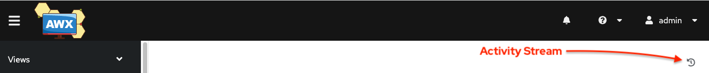
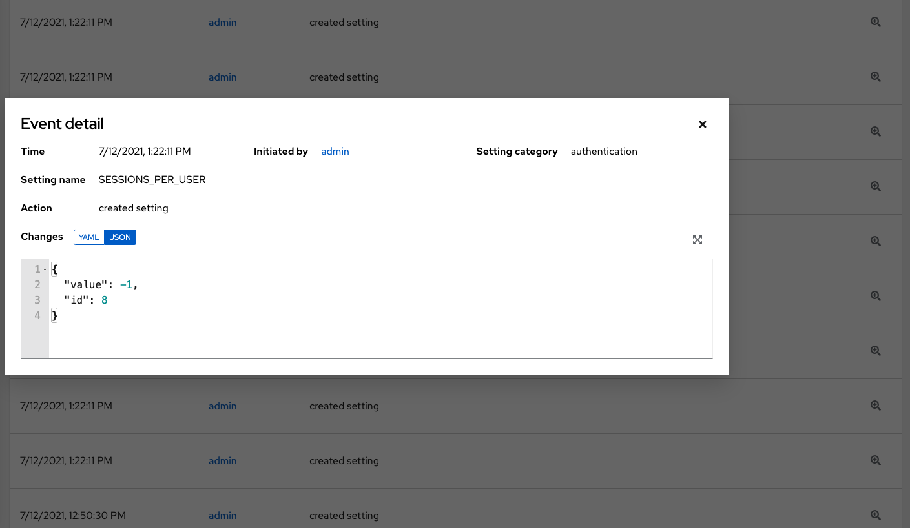

The User Interface
------------------

.. index::
   pair: main menu; dashboard

The User Interface offers a friendly graphical framework for your IT orchestration needs. The left navigation bar provides quick access to resources, such as **Projects**, **Inventories**, **Job Templates**, and **Jobs**.

Across the top-right side of the interface, you can access your user profile, the About page, view related documentation, and log out. Right below these options, you can view the activity stream for that user by clicking on the Activity Stream |activitystream| button. 

.. |activitystream| image:: ../common/images/activitystream.png

.. _ug_activitystreams:

Activity Streams
======================

.. index::
   single: activity streams

Most screens have an Activity Stream (|activitystream|) button. Clicking this brings up the
**Activity Stream** for this object.

|Users - Activity Stream|

.. |Users - Activity Stream| image:: ../common/images/users-activity-stream.png

An Activity Stream shows all changes for a particular object. For each change, the Activity Stream shows the time of the event, the user that
initiated the event, and the action. The information displayed varies depending on the type of event. Clicking on the Examine (|examine|) button shows the event log for the change.

.. |examine| image:: ../common/images/examine-button.png

|event log|

The Activity Stream can be filtered by the initiating user (or the
system, if it was system initiated), and by any related object,
such as a particular credential, job template, or schedule.

The Activity Stream on the main Dashboard shows the Activity Stream for the entire instance. Most pages allow viewing an activity stream filtered for that specific object.

Views
========

.. index::
   single: dashboard
   pair: views; jobs
   pair: views; schedule   

The User Interface provides several options for viewing information. 

.. contents::
    :local:

Dashboard view
~~~~~~~~~~~~~~~

.. index:: 
   pair: dashboard; job status
   pair: dashboard; jobs tab
   pair: dashboard; schedule status
   pair: dashboard; host count

   

The **Dashboard** view begins with a summary of your hosts, inventories, and projects. Each of these is linked to the corresponding objects for easy access.

On the main Dashboard screen, a summary appears listing your current **Job Status**. The **Job Status** graph displays the number of successful and failed jobs over a specified time period. You can choose to limit the job types that are viewed, and to change the time horizon of the graph.

Also available for view are summaries of **Recent Jobs** and **Recent Templates** on their respective tabs.

The **Recent Jobs** section displays which jobs were most recently run, their status, and time when they were run as well.

.. image:: ../common/images/ug-dashboard-recent-jobs.png

The **Recent Templates** section of this display shows a summary of the most recently used templates. You can also access this summary by clicking **Templates** from the left navigation bar.

.. image:: ../common/images/ug-dashboard-recent-templates.png

.. note::

    Clicking on **Dashboard** from the left navigation bar or the |aap| logo at any time returns you to the Dashboard. 

Jobs view
~~~~~~~~~~

Access the **Jobs** view by clicking **Jobs** from the left navigation bar. This view shows all the jobs that have ran, including projects, templates, management jobs, SCM updates, playbook runs, etc.

Schedules view
~~~~~~~~~~~~~~~

Access the Schedules view by clicking **Schedules** from the left navigation bar. This view shows all the scheduled jobs that are configured.

.. image:: ../common/images/ug-dashboard-schedule-view.png

Resources and Access
======================

The **Resources** and **Access** menus provide you access to the various components of |at| and allow you to configure who has permissions for which of those resources.

Administration Menu
===================

.. index::
   single: admin menu

The **Administration** menu provides access to the various administrative options: 

From here, you can create, view, and edit :ref:`custom credential types <ug_credential_types>`, :ref:`notifications <ug_notifications>`, management jobs, :ref:`tokens and applications <ug_applications_auth>`, and configure :ref:`ug_execution_environments`. 

The Settings Menu
===================

Configuring global and system-level settings is accomplished through the **Settings** menu, which is described in further detail in the proceeding section. The **Settings** menu offers access to administrative configuration options.

.. include:: ../common/settings-menu.rst
